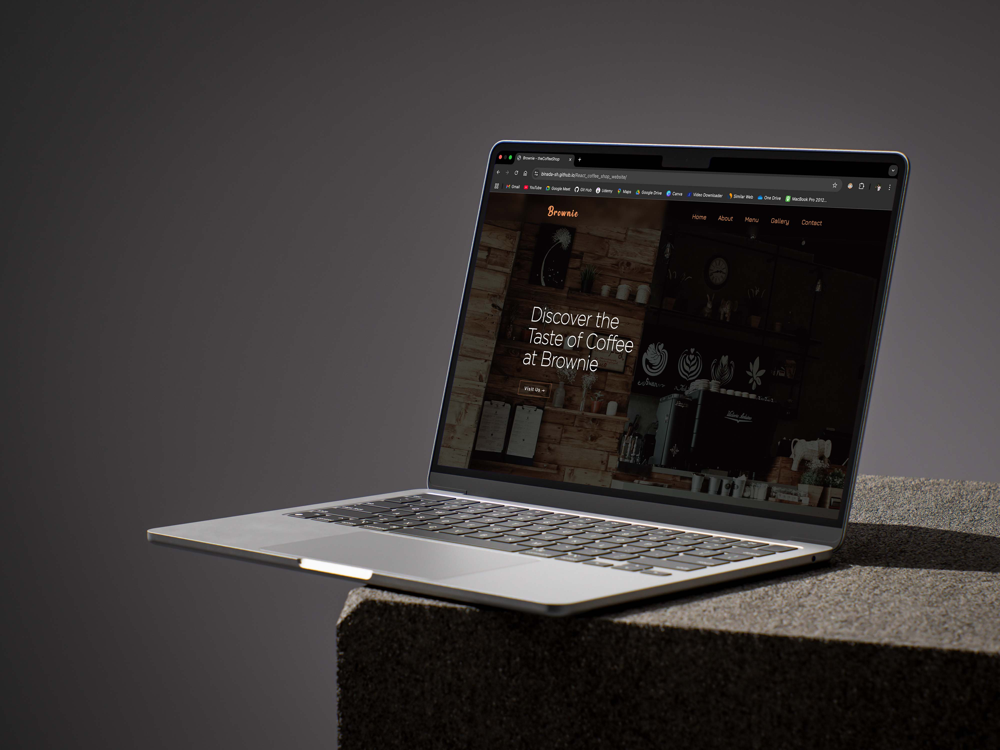
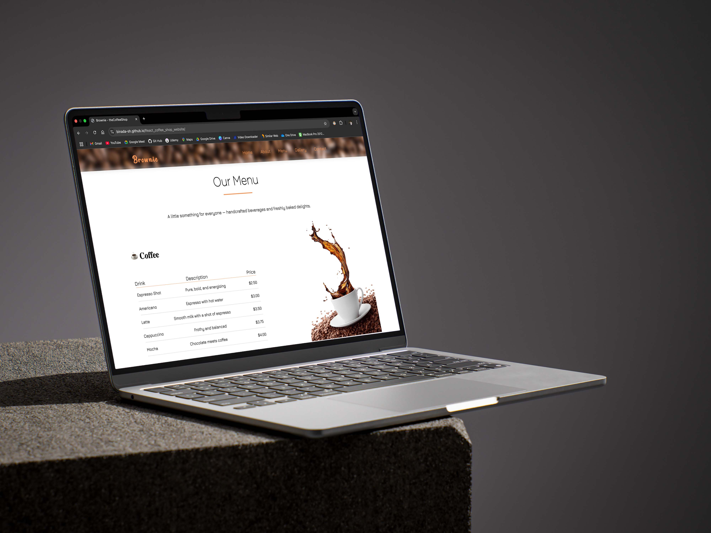

# Coffee Shop Website

## Overview

This project is a website for a coffee shop, designed and implemented using React. It features a responsive layout, a simple, clean design, and smooth navigation.

## Features

* **Responsive Design**: The website adapts to different screen sizes (desktops, tablets, and smartphones).
* **Simple and Clean Design**: Provides a user-friendly experience with a focus on clarity and ease of navigation.
* **Implemented with React**: Built using React components for a dynamic and interactive user interface.
* **Smooth Navigation**: Implements React Router for seamless page transitions.
* **Modern UI**: Uses styled components
* **About Section**: Information regarding the Coffee Shop
* **Menu Section**: Details of the food and beverages the Coffee Shop provides.

## Technologies Used

* React
* React Router
* Styled Components
* React Icons

<h6> This is a sample project and, This application is available @ <a href src='https://binada-sh.github.io/React_coffee_shop_website/' target='_blank'> this link </a></h6>

###### © 2025 - Binada Hettiarachchi. All Rights Reserved. ######
